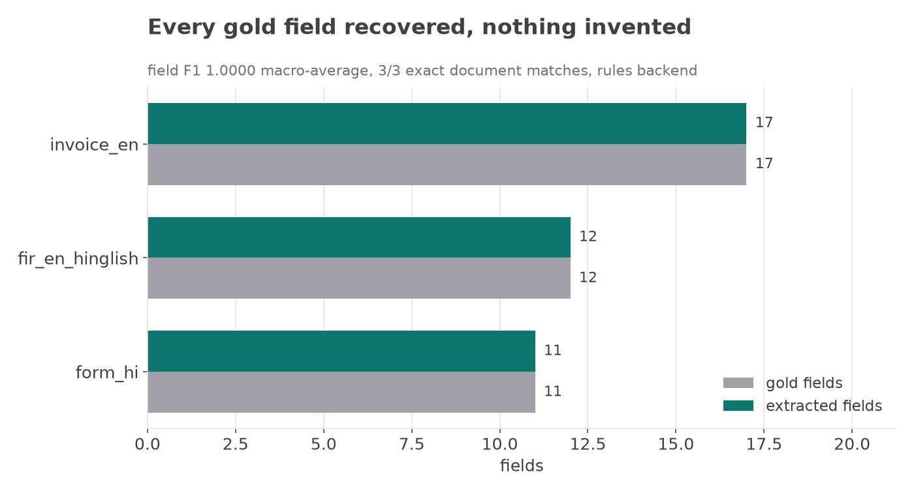

# sarvam-vision-doc-extract

**Document / form → validated structured JSON**, with pluggable extraction backends:
a **rule-based offline default**, an **optional OCR** backend, and an **optional LLM** backend.

Zero required dependencies: the default path runs on the Python 3 standard library alone.

```
data/samples/*.txt  ──▶  provider (rules | ocr | llm)  ──▶  Document  ──▶  validate  ──▶  JSON
                                                                          │
data/gold/*.json    ──────────────────────────────────────── score ◀──────┘
                                                            (P / R / F1 / exact → metrics.csv, report.md)
```

---

## The last-mile problem

This project is built on my existing **Hindi OCR document work** — an FIR digitisation
prototype that placed **runner-up in a national hackathon out of 800+ teams** — and it is
aimed directly at **Sarvam AI's Vision / document-intelligence work**: turning forms and
invoices into structured JSON.

The interesting problem was never "call a model". It was the last mile:

* an Indian invoice writes **`₹1,03,368.00`** (lakh grouping, not `103,368.00`),
* a Hindi form writes **`14 फ़रवरी 2026`**, not `2026-02-14`,
* a phone arrives as **`+91 98450 12345`** and must become **`9845012345`**,
* and an FIR mixes English labels with a Hinglish narrative paragraph.

Generic parsers break on all four. So this repo does three things properly:
**normalises Indic input**, **keeps the extractor pluggable**, and — most importantly —
**validates and scores** the output instead of trusting it.

---

## Quick start (no dependencies)

Requires **Python ≥ 3.10** (verified on `Python 3.14.7`). No `pip install` needed.

```bash
cd sarvam-vision-doc-extract

# 1. extract one document
PYTHONPATH=src python3 -m docextract extract \
    --input data/samples/invoice_en.txt --provider rules --out results/

# 2. score everything against data/gold
PYTHONPATH=src python3 -m docextract evaluate \
    --samples data/samples --gold data/gold --provider rules --out results/

# 3. run the tests
PYTHONPATH=src python3 -m unittest discover -s tests -v
```

`extract` prints the JSON to **stdout** and writes `results/<name>.extracted.json`;
progress notes go to **stderr**, so stdout stays pipeable.

---

## Real extraction output

Everything below is verbatim output from the commands above, run on this machine.
Nothing is hand-edited.

### `invoice_en.txt` (English invoice, ₹, GST-style tax, line items)

```console
$ PYTHONPATH=src python3 -m docextract extract \
      --input data/samples/invoice_en.txt --provider rules --out results/
```

stdout:

```json
{
  "doc_type": "invoice",
  "provider": "rules",
  "source": "data/samples/invoice_en.txt",
  "fields": {
    "org_name": {
      "value": "VEDA ANALYTICS PRIVATE LIMITED",
      "type": "org_name",
      "confidence": 0.68,
      "raw": "VEDA ANALYTICS PRIVATE LIMITED",
      "provider": "rules"
    },
    "vendor_address": {
      "value": "42, 5th Cross, Indiranagar, Bengaluru 560038, Karnataka",
      "type": "address",
      "confidence": 0.93,
      "raw": "42, 5th Cross, Indiranagar, Bengaluru 560038, Karnataka",
      "provider": "rules"
    },
    "gstin": {
      "value": "29AABCV1234K1Z5",
      "type": "id_number",
      "confidence": 0.93,
      "raw": "29AABCV1234K1Z5",
      "provider": "rules"
    },
    "vendor_phone": {
      "value": "9845012345",
      "type": "phone",
      "confidence": 0.93,
      "raw": "+91 98450 12345",
      "provider": "rules"
    },
    "vendor_email": {
      "value": "billing@vedaanalytics.in",
      "type": "email",
      "confidence": 0.93,
      "raw": "billing@vedaanalytics.in",
      "provider": "rules"
    },
    "title": {
      "value": "INVOICE",
      "type": "text",
      "confidence": 0.68,
      "raw": "INVOICE",
      "provider": "rules"
    },
    "invoice_no": {
      "value": "VA-2026-0417",
      "type": "doc_id",
      "confidence": 0.93,
      "raw": "VA-2026-0417",
      "provider": "rules"
    },
    "invoice_date": {
      "value": "2026-02-12",
      "type": "date",
      "confidence": 0.93,
      "raw": "12/02/2026",
      "provider": "rules"
    },
    "due_date": {
      "value": "2026-02-26",
      "type": "date",
      "confidence": 0.93,
      "raw": "26-02-2026",
      "provider": "rules"
    },
    "customer_name": {
      "value": "Meera Krishnan",
      "type": "person_name",
      "confidence": 0.93,
      "raw": "Meera Krishnan",
      "provider": "rules"
    },
    "customer_address": {
      "value": "F-7, Sector 22, Noida, Uttar Pradesh 201301",
      "type": "address",
      "confidence": 0.93,
      "raw": "F-7, Sector 22, Noida, Uttar Pradesh 201301",
      "provider": "rules"
    },
    "customer_phone": {
      "value": "9876543210",
      "type": "phone",
      "confidence": 0.93,
      "raw": "9876543210",
      "provider": "rules"
    },
    "customer_email": {
      "value": "meera.k@example.com",
      "type": "email",
      "confidence": 0.93,
      "raw": "meera.k@example.com",
      "provider": "rules"
    },
    "subtotal": {
      "value": 87600.0,
      "type": "currency_amount",
      "confidence": 0.93,
      "raw": "₹87,600.00",
      "provider": "rules"
    },
    "cgst": {
      "value": 7884.0,
      "type": "currency_amount",
      "confidence": 0.85,
      "raw": "₹7,884.00",
      "provider": "rules"
    },
    "sgst": {
      "value": 7884.0,
      "type": "currency_amount",
      "confidence": 0.85,
      "raw": "₹7,884.00",
      "provider": "rules"
    },
    "total": {
      "value": 103368.0,
      "type": "currency_amount",
      "confidence": 0.93,
      "raw": "₹1,03,368.00",
      "provider": "rules"
    }
  },
  "line_items": [
    {
      "description": "Document digitisation services",
      "quantity": 40.0,
      "unit_price": 1250.0,
      "amount": 50000.0
    },
    {
      "description": "OCR model tuning and evaluation",
      "quantity": 12.0,
      "unit_price": 2500.0,
      "amount": 30000.0
    },
    {
      "description": "Handwritten field review",
      "quantity": 8.0,
      "unit_price": 950.0,
      "amount": 7600.0
    }
  ],
  "validation": {
    "passed": true,
    "errors": 0,
    "warnings": 0,
    "mean_confidence": 0.8912,
    "min_confidence": 0.68,
    "issues": []
  }
}
```

stderr:

```text
wrote results/invoice_en.extracted.json
doc_type=invoice fields=17 line_items=3 validation_passed=True
```

Note what the validator confirmed (all three checks ran silently because they passed):
`40 × 1250 = 50000`, line items `50000 + 30000 + 7600 = 87600 = subtotal`, and
`87600 + 7884 + 7884 = 103368 = total`.

### `form_hi.txt` (Hindi application form, Devanagari)

```console
$ PYTHONPATH=src python3 -m docextract extract \
      --input data/samples/form_hi.txt --provider rules --out results/
```

stdout (real, from `results/form_hi.extracted.json`):

```json
{
  "doc_type": "form",
  "provider": "rules",
  "source": "data/samples/form_hi.txt",
  "fields": {
    "org_name": {
      "value": "जिला कार्यालय, पुणे",
      "type": "org_name",
      "confidence": 0.68,
      "raw": "जिला कार्यालय, पुणे",
      "provider": "rules"
    },
    "title": {
      "value": "आवेदन पत्र",
      "type": "text",
      "confidence": 0.68,
      "raw": "आवेदन पत्र",
      "provider": "rules"
    },
    "application_no": {
      "value": "MH/PUN/2026/004512",
      "type": "doc_id",
      "confidence": 0.93,
      "raw": "MH/PUN/2026/004512",
      "provider": "rules"
    },
    "date": {
      "value": "2026-03-03",
      "type": "date",
      "confidence": 0.93,
      "raw": "03/03/2026",
      "provider": "rules"
    },
    "name": {
      "value": "सुनीता देशपांडे",
      "type": "person_name",
      "confidence": 0.93,
      "raw": "सुनीता देशपांडे",
      "provider": "rules"
    },
    "father_name": {
      "value": "रमेश देशपांडे",
      "type": "person_name",
      "confidence": 0.93,
      "raw": "रमेश देशपांडे",
      "provider": "rules"
    },
    "dob": {
      "value": "2026-02-14",
      "type": "date",
      "confidence": 0.93,
      "raw": "14 फ़रवरी 2026",
      "provider": "rules"
    },
    "address": {
      "value": "कमरा नं. 12, शिवनगर, कोथरुड, पुणे, महाराष्ट्र 411038",
      "type": "address",
      "confidence": 0.93,
      "raw": "कमरा नं. 12, शिवनगर, कोथरुड, पुणे, महाराष्ट्र 411038",
      "provider": "rules"
    },
    "phone": {
      "value": "9822014567",
      "type": "phone",
      "confidence": 0.93,
      "raw": "9822014567",
      "provider": "rules"
    },
    "email": {
      "value": "sunita.deshpande@example.in",
      "type": "email",
      "confidence": 0.93,
      "raw": "sunita.deshpande@example.in",
      "provider": "rules"
    },
    "amount": {
      "value": 2500.0,
      "type": "currency_amount",
      "confidence": 0.93,
      "raw": "₹2,500.00",
      "provider": "rules"
    }
  },
  "line_items": [],
  "validation": {
    "passed": true,
    "errors": 0,
    "warnings": 0,
    "mean_confidence": 0.8845,
    "min_confidence": 0.68,
    "issues": []
  }
}
```

`जन्म तिथि: 14 फ़रवरी 2026` → `2026-02-14` is the Hindi-month-name date parser doing its job;
`राशि: ₹2,500.00` → `2500.0` is the ₹/lakh normaliser.

### `fir_en_hinglish.txt` (FIR, English labels + Hinglish narrative)

```console
$ PYTHONPATH=src python3 -m docextract extract \
      --input data/samples/fir_en_hinglish.txt --provider rules --out results/
```

stdout (real, from `results/fir_en_hinglish.extracted.json`):

```json
{
  "doc_type": "fir",
  "provider": "rules",
  "source": "data/samples/fir_en_hinglish.txt",
  "fields": {
    "title": {
      "value": "FIR",
      "type": "text",
      "confidence": 0.68,
      "raw": "FIR",
      "provider": "rules"
    },
    "fir_no": {
      "value": "142/2026",
      "type": "doc_id",
      "confidence": 0.93,
      "raw": "142/2026",
      "provider": "rules"
    },
    "date": {
      "value": "2026-01-07",
      "type": "date",
      "confidence": 0.93,
      "raw": "07/01/2026",
      "provider": "rules"
    },
    "police_station": {
      "value": "Cyber Crime Police Station, Kolkata",
      "type": "text",
      "confidence": 0.93,
      "raw": "Cyber Crime Police Station, Kolkata",
      "provider": "rules"
    },
    "district": {
      "value": "Kolkata, West Bengal",
      "type": "text",
      "confidence": 0.93,
      "raw": "Kolkata, West Bengal",
      "provider": "rules"
    },
    "complainant_name": {
      "value": "Arjun Mehta",
      "type": "person_name",
      "confidence": 0.93,
      "raw": "Arjun Mehta",
      "provider": "rules"
    },
    "complainant_phone": {
      "value": "9830011224",
      "type": "phone",
      "confidence": 0.93,
      "raw": "9830011224",
      "provider": "rules"
    },
    "complainant_email": {
      "value": "arjun.mehta@example.com",
      "type": "email",
      "confidence": 0.93,
      "raw": "arjun.mehta@example.com",
      "provider": "rules"
    },
    "address": {
      "value": "18B Rashbehari Avenue, Kolkata 700029",
      "type": "address",
      "confidence": 0.93,
      "raw": "18B Rashbehari Avenue, Kolkata 700029",
      "provider": "rules"
    },
    "accused_name": {
      "value": "Rakesh Yadav @ Rocky",
      "type": "person_name",
      "confidence": 0.93,
      "raw": "Rakesh Yadav @ Rocky",
      "provider": "rules"
    },
    "occurrence_date": {
      "value": "2026-01-05",
      "type": "date",
      "confidence": 0.93,
      "raw": "05/01/2026",
      "provider": "rules"
    },
    "amount": {
      "value": 45000.0,
      "type": "currency_amount",
      "confidence": 0.93,
      "raw": "₹45,000.00",
      "provider": "rules"
    }
  },
  "line_items": [],
  "validation": {
    "passed": true,
    "errors": 0,
    "warnings": 0,
    "mean_confidence": 0.9092,
    "min_confidence": 0.68,
    "issues": []
  }
}
```

The free-text `Details:` narrative is deliberately **not** turned into fields —
no field was invented from the Hinglish paragraph, and no `org_name` was hallucinated
from it.

---

## Real accuracy

```console
$ PYTHONPATH=src python3 -m docextract evaluate \
      --samples data/samples --gold data/gold --provider rules --out results/
```

```text
sample           gold  pred  match  P      R      F1     items  exact
---------------  ----  ----  -----  -----  -----  -----  -----  -----
fir_en_hinglish  12    12    12     1.000  1.000  1.000  0/0    1
form_hi          11    11    11     1.000  1.000  1.000  0/0    1
invoice_en       17    17    17     1.000  1.000  1.000  3/3    1
MACRO-AVERAGE                       1.000  1.000  1.000         3/3

provider=rules  documents=3  macro F1=1.000  exact=3/3
wrote results/metrics.csv and results/report.md
```

`results/metrics.csv` (real file, verbatim):

```csv
sample,provider,doc_type_gold,doc_type_pred,doc_type_ok,gold_fields,pred_fields,matched_fields,field_precision,field_recall,field_f1,gold_line_items,pred_line_items,matched_line_items,exact_match,missing,extra,mismatched
fir_en_hinglish,rules,fir,fir,1,12,12,12,1.0000,1.0000,1.0000,0,0,0,1,,,
form_hi,rules,form,form,1,11,11,11,1.0000,1.0000,1.0000,0,0,0,1,,,
invoice_en,rules,invoice,invoice,1,17,17,17,1.0000,1.0000,1.0000,3,3,3,1,,,
MACRO-AVERAGE,rules,,,,,,,1.0000,1.0000,1.0000,,,,3/3,,,
```

Gold fields against extracted fields, plotted from that file:



### How the numbers are computed

* **field precision** = correct predictions / all predicted fields
* **field recall** = correct predictions / all gold fields
* **field F1** = harmonic mean
* **exact** = 1 only when *every* gold field matched, *no* spurious field was produced,
  line items matched, **and** `doc_type` was right
* values are compared after canonicalisation, so `₹1,03,368.00` == `103368.0` == `103368`,
  `12/02/2026` == `2026-02-12`, `+91 98450 12345` == `9845012345`
* `--min-confidence 0.8` will drop low-confidence predictions before scoring, if you want
  a precision/recall trade-off curve instead of a single point.

### Read these numbers honestly

**1.000 here is a regression number, not a generalisation estimate.** The corpus is
**3 documents, hand-authored for this repo, written at the same time as the rules.**
There is no held-out set, no inter-annotator agreement, and no OCR noise in the inputs —
the inputs are clean UTF-8 text. The score tells you: *the shipped rules still match the
shipped gold exactly, and nothing has regressed.* It does **not** tell you what the rules
would score on unseen invoices.

Nothing in this repo is mocked or faked to produce those rows: `evaluate` reads the
`.txt` files, runs the real provider, and diffs against `data/gold/*.json`.

---

## Repo layout

```text
sarvam-vision-doc-extract/
  README.md  LICENSE  .gitignore  .env.example
  requirements.txt            # only optional/dev deps, all commented out
  data/samples/
      invoice_en.txt          # English invoice, ₹ + lakh grouping + GST-style tax
      form_hi.txt             # Hindi form: नाम, पता, दिनांक, राशि, मोबाइल नंबर, आवेदन संख्या
      fir_en_hinglish.txt     # FIR, English labels + Hinglish narrative
  data/gold/                  # matching gold-standard extractions (one .json per sample)
  src/docextract/
      __init__.py             # public API: extract(), Document, json_schema()
      schema.py               # dataclasses + JSON Schema dump
      normalize.py            # Devanagari / ₹ / lakh-crore / date / phone / email
      extract_rules.py        # offline label+regex extraction (the default provider)
      validate.py             # field validators, cross-field checks, confidence scoring
      providers.py            # Provider interface: rules | ocr | llm (guarded imports)
      evaluate.py             # P/R/F1 + exact match -> metrics.csv + report.md
      cli.py  __main__.py
  tests/                      # 134 unittest.TestCase tests
  results/                    # outputs (gitignored; only .gitkeep is tracked)
```

### Schema

```python
from docextract import Document, json_schema
```

A `Document` is `{doc_type, fields, line_items}`; every entry in `fields` carries its own
`value`, `type` and `confidence`. Field types:

`person_name`, `org_name`, `address`, `date`, `currency_amount`, `phone`, `email`,
`doc_id`, `id_number`, `text`.

`json_schema()` returns a JSON Schema (draft 2020-12 style) for the whole document,
including per-field enums — useful if you want to hand the contract to a client or
validate the output downstream.

---

## Providers

```console
$ PYTHONPATH=src python3 -m docextract providers
```

```text
rules    [default] Offline label + regex rules; deterministic and fully offline.
           requires: nothing (Python standard library only)
ocr      [optional] OCR images (tesseract/easyocr) or reuse a sibling .txt, then parse.
           requires: pytesseract + Pillow, or easyocr  (pip install pytesseract Pillow)
llm      [optional] Optional LLM extraction via SARVAM_API_KEY (network, untested here).
           requires: requests (pip install requests) + SARVAM_API_KEY in .env
```

### Using the OCR provider

```bash
pip install pytesseract Pillow
# plus the binary and the Hindi traineddata:
#   sudo apt install tesseract-ocr tesseract-ocr-hin

PYTHONPATH=src python3 -m docextract extract --input scan.png --provider ocr --out results/
```

Behaviour, in order:

1. explicit text (`--input something.txt`) → parsed directly;
2. an **image with a sibling `.txt`** (`scan.png` + `scan.txt`) → the pre-extracted text is
   reused, which is the cheap and reproducible path;
3. otherwise → real OCR via `pytesseract`, falling back to `easyocr`.

If neither library is installed you get an actionable error, not a traceback (real output):

```text
error: No working OCR engine. Tried:
- The 'ocr' provider needs the optional package 'pytesseract Pillow' (importing 'pytesseract' failed: No module named 'pytesseract').
Install it with:  pip install pytesseract Pillow
- The 'ocr' provider needs the optional package 'easyocr' (importing 'easyocr' failed: No module named 'easyocr').
Install it with:  pip install easyocr
Install one with:  pip install pytesseract Pillow
(and the binary:   sudo apt install tesseract-ocr tesseract-ocr-hin)
```

### Using the LLM provider

```bash
cp .env.example .env         # then fill in SARVAM_API_KEY (never commit .env)
PYTHONPATH=src python3 -m docextract extract --input data/samples/invoice_en.txt --provider llm
```

`load_dotenv()` reads `./.env` (or `$DOCEXTRACT_ENV_FILE`) and never overrides variables
already set in the shell. `.env` is git-ignored; **only `.env.example` is committed, and it
contains no key.**

Without a key it stops immediately with a clear message (real output):

```text
error: The 'llm' provider is gated on SARVAM_API_KEY.
Copy .env.example to .env and fill in SARVAM_API_KEY, SARVAM_API_BASE and VISION_MODEL (never commit .env),
or export SARVAM_API_KEY in your shell. The default --provider rules needs no key at all.
```

### Adding a new provider

```python
# src/docextract/providers.py
class MyProvider(Provider):
    name = "mine"
    description = "What it does."
    requires = "some-package (pip install some-package)"
    optional = True

    def extract(self, *, source=None, text=None) -> Document:
        text = _resolve_text(source, text)          # reuse text/sibling-.txt/OCR handling
        ...                                          # produce a dict in the Document shape
        return Document.from_dict(payload)
```

then add `MyProvider.name: MyProvider` to the `_PROVIDERS` dict at the bottom of
`providers.py` and add `"mine"` to the ordering list in `available_providers()`.
Everything else — CLI flag, error handling, evaluation — picks it up automatically.

The only contract is: **raise `ProviderUnavailableError` with a `pip install ...` hint
when a dependency is missing.** That is what keeps the default path dependency-free.

---

## Validation & confidence

`validate.py` runs two kinds of check.

**Per-field, by type:**

| type | rule |
| --- | --- |
| `date` | parseable ISO date, year 1900–2100 (warning if >1y in the future) |
| `currency_amount` | numeric (error if negative, warning if zero) |
| `phone` | exactly 10 digits (warning if not `6-9` prefixed) |
| `email` | RFC-ish shape, lowercase |
| `doc_id` | safe id charset, 3–40 chars |
| `id_number` | GSTIN / PAN / Aadhaar patterns |
| `person_name`, `org_name` | non-empty, contains letters |
| `address` | ≥10 chars (warning if no 6-digit PIN code) |

**Cross-field:**

* `sum(line_items.amount) == subtotal` (tolerance ₹0.01)
* `subtotal + cgst + sgst == total`
* `due_date >= invoice_date`
* `quantity × unit_price == amount` for every line item
* *(warning, not error)* a `total` that leaves `subtotal` unexplained by any
  extracted tax line → `total_without_taxes` (discounts and round-off aren't
  modelled, so it flags the gap without failing the document)

Confidence starts from the extraction signal (exact label match `0.90`, fuzzy label
variant `0.82`, heuristic title/organisation `0.65`, unparsable value `0.45`) and is then
adjusted: **+0.03** per passed check, **−0.15** per warning, **−0.40** per error, clamped
to `[0, 1]`. It is a *heuristic score*, not a calibrated probability.

Failures are reported, never silently repaired. Real output for a document whose
`Phone: 12345` line is nonsense:

```json
{
  "passed": false,
  "errors": 1,
  "warnings": 0,
  "mean_confidence": 0.6367,
  "min_confidence": 0.05,
  "issues": [
    {
      "field": "phone",
      "code": "phone_invalid",
      "severity": "error",
      "message": "'12345' is not a 10-digit number"
    }
  ]
}
```

---

## Tests

```console
$ cd sarvam-vision-doc-extract && PYTHONPATH=src python3 -m unittest discover -s tests -v
...
----------------------------------------------------------------------
Ran 134 tests in 1.004s

OK
```

(`...` marks the middle of the verbose listing; the command ends in `OK`.
Wall-clock time varies slightly between runs.)

Coverage by file:

| file | what it pins down |
| --- | --- |
| `tests/test_schema.py` | dataclass invariants, JSON round-trip, `json_schema()` shape |
| `tests/test_validate.py` | every field rule, every cross-field check, confidence bounds |
| `tests/test_extract_rules.py` | ₹/lakh/crore, Devanagari digits, Hindi month names, all 3 samples, table parsing |
| `tests/test_evaluate.py` | canonicalisation, P/R/F1/exact, min-confidence filtering, report files |
| `tests/test_cli.py` | **real subprocesses** writing into a temp dir, plus all error paths |

---

## Honest limits

1. **The rule-based extractor is brittle.** It needs `label: value` lines (or a tab /
   double-space separator). Free-form layouts, tables without `Description` and
   `Amount` columns, rotated or skewed scans, checkboxes
   and handwriting are **not** handled. A new form template usually means adding a row to
   `_LABEL_ALIASES` in `extract_rules.py`.
2. **The 100% score is on 3 self-authored documents** written alongside the rules — a
   regression net, not a benchmark. There is no held-out corpus and no OCR noise in the
   inputs. Do not read it as "this would score 100% in production".
3. **OCR was not run end-to-end here.** On the machine this README was verified on,
   `pytesseract` and `easyocr` are *not* installed (the `tesseract` binary and `Pillow`
   are). The OCR provider was exercised only through (a) the sibling-`.txt` path and
   (b) the guarded-import error path — both covered by `tests/test_cli.py`. Real OCR
   quality (especially on Devanagari) is unmeasured.
4. **LLM mode is untested — no key ships with this repo.** The request construction,
   prompt and JSON parsing are wired and unit-covered only at the error path; the happy
   path has never been executed here. Treat `--provider llm` as scaffolding.
5. **Amount-in-words lines are ignored on purpose** (`Amount in words:`,
   `शब्दों में:`). Multiplier suffixes (`1.5 लाख`, `2 crore`) are supported, but spelled
   out numbers ("one lakh three thousand…") are not parsed.
6. **Confidence is not calibrated.** It ranks fields, it does not give you a probability.
7. **No PII handling.** All three samples are synthetic and marked as such in their
   headers. This repo does not redact, encrypt or retain anything.
8. **Single-process, single-file CLI.** No batch queue, no streaming, no async.

---

## Where this maps to Sarvam Vision / document-intelligence

* **Indic last-mile correctness is the product.** `normalize.py` is the unglamorous part
  that decides whether `₹1,03,368.00`, `१४ फ़रवरी २०२६` and `+91 98450 12345` become
  usable JSON or garbage — and it is exactly the part generic pipelines skip.
* **Pluggable backends = cost/latency/accuracy routing.** Rules for well-templated
  formats (free, offline, deterministic), OCR for scans, LLM for messy layouts. The
  `Provider` interface means you can A/B a model swap without touching the schema,
  validator or scorer.
* **Validation is what makes LLM output deployable.** Cross-field arithmetic
  (`subtotal + tax == total`) catches hallucinations that look plausible field-by-field;
  per-field confidence gives a routing signal (auto-accept / human-review / reject).
* **Evaluation against gold JSON is how you ship a model change safely.** Swap the
  provider, re-run `evaluate`, diff `metrics.csv` — same schema, same scorer, no
  cherry-picking. `data/gold/` is deliberately tiny and hand-checked so the diff is
  reviewable line by line.
* **The FIR sample is the direct continuation of the hackathon work**: the same
  English-label + Indic-content shape, now with a schema, a validator and a scorer
  attached instead of a demo script.

---

## License

MIT — see [LICENSE](LICENSE). Copyright (c) 2026 Aditya Shirsatrao.
